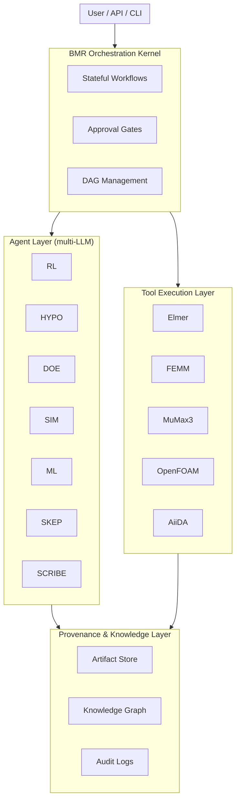

# BMR Framework

**BMad Materials Research** — An AI-driven research orchestration system for magnet and electromagnetic device R&D.

## Overview

BMR is a specification framework for orchestrating multi-fidelity simulations, ML surrogates, and experimental design through LLM agents. It enforces reproducibility, cost-aware autonomy, and closed-loop learning.

**This is a specification repository**, not executable code. It defines schemas, agent prompts, and methodologies consumed by LLM agents and workflow orchestrators.

## Architecture

```
┌─────────────────────────────────────────────────────────────┐
│                    User / API / CLI                         │
└─────────────────────────┬───────────────────────────────────┘
                          │
┌─────────────────────────▼───────────────────────────────────┐
│              BMR Orchestration Kernel                       │
│         (stateful workflows, gates, DAGs)                   │
└───────┬─────────────────────────────────────┬───────────────┘
        │                                     │
┌───────▼───────────┐             ┌───────────▼───────────────┐
│   Agent Layer     │             │  Tool Execution Layer     │
│  (multi-LLM)      │             │  (ML, simulation, DB)     │
│                   │             │                           │
│  RL  HYPO  DOE    │             │  Elmer  FEMM  MuMax3      │
│  SIM  ML  SKEP    │             │  OpenFOAM  Quantum ESPRESSO│
│  SCRIBE           │             │  AiiDA  Gmsh  ParaView    │
└───────────────────┘             └───────────────────────────┘
        │                                     │
┌───────▼─────────────────────────────────────▼───────────────┐
│           Provenance, Memory & Knowledge Layer              │
│          (graphs, artifacts, embeddings, audit logs)        │
└─────────────────────────────────────────────────────────────┘
```

<details>
<summary>Mermaid diagram (click to expand)</summary>



</details>

## Core Principles

1. **Reproducibility over novelty** — Any result that cannot be replayed from stored manifests is invalid
2. **Agents reason; systems execute** — LLM agents propose actions, deterministic runners execute tools
3. **Autonomy is earned** — Automation increases only with demonstrated predictive reliability
4. **Human approval is risk-based** — Humans approve risk (cost × uncertainty), not routine execution
5. **Negative results are first-class artifacts** — Failed hypotheses and null results must be preserved
6. **Every decision must be defensible** — All outputs must cite assumptions, inputs, and uncertainty

## Key Documents

| Document | Purpose |
|----------|---------|
| [BMR-CORE.md](BMR-CORE.md) | Core specification: principles, architecture, agent contracts |
| [BMR-WORKFLOWS.md](BMR-WORKFLOWS.md) | Canonical workflows: hypothesis-sprint, doe-plan, closed-loop-iteration |
| [BMR-TOOL-CONTRACTS.md](BMR-TOOL-CONTRACTS.md) | Tool execution interface specification |
| [agent_prompts.md](agent_prompts.md) | System prompts and JSON schemas for 7 agent roles |
| [SAL.md](SAL.md) | Scientific Action Language — CLAIM → INTERVENTION → TEST → UPDATE |
| [tool_registry_moat_spec_v0_2_0.json](tool_registry_moat_spec_v0_2_0.json) | Physics graph, KPIs, tool implementations |

### Domain Adapters

| Adapter | Domain |
|---------|--------|
| [BMR-MAGNETS-ADAPTER.md](BMR-MAGNETS-ADAPTER.md) | Permanent magnets (Nd-Fe-B, RE-lean) |
| [BMR-REFERENCE-CAMPAIGN.md](BMR-REFERENCE-CAMPAIGN.md) | Worked example: RE-reduction campaign |

## Agent Roles

| Abbrev | Role | Purpose |
|--------|------|---------|
| RL | Research Lead | Defines objectives and constraints |
| HYPO | Hypothesis Agent | Generates competing, falsifiable hypotheses |
| DOE | DOE Agent | Designs cost-aware experiment batches |
| SIM | Simulation Orchestrator | Assigns fidelity levels and methods |
| ML | ML Agent | Trains and validates surrogate models |
| SKEP | Skeptic / QA | Challenges conclusions and prevents overconfidence |
| SCRIBE | Scribe / IP | Produces decision-ready and IP-ready documents |
| SYSTEM | Runner | Executes manifests deterministically |

## Fidelity Hierarchies

BMR uses two complementary fidelity systems:

**L-Levels (Method Fidelity)** — What method class to use:
- L0: Literature heuristics
- L1: ML screening
- L2: Physics-informed surrogates
- L3: CALPHAD / phase models
- L4: Targeted DFT
- L5: Full micromagnetics

**T-Tiers (Implementation Fidelity)** — How refined within a method:
- T0: Fast screening (coarse mesh)
- T1: Standard fidelity
- T2: Refined fidelity
- T3: High fidelity (coupled multiphysics)

**Policy:** Start at lowest T-tier within the required L-level. Escalate only when uncertainty reduction justifies cost.

## Closed-Loop Research Cycle

```
    ┌──────────────────────────────────────────────────┐
    │                                                  │
    ▼                                                  │
┌───────┐    ┌─────────────┐    ┌──────┐    ┌────────┐ │
│ CLAIM │───▶│INTERVENTION │───▶│ TEST │───▶│ UPDATE │─┘
└───────┘    └─────────────┘    └──────┘    └────────┘
    │              │               │            │
    │              │               │            │
hypothesis    DOE plan      simulation    model update
generation    + fidelity    execution     + confidence
              assignment                  recalibration
```

This cycle maps directly to the `closed-loop-iteration` workflow. See [SAL.md](SAL.md) for formal semantics.

## Quick Start (For Implementers)

1. **Understand the core** — Read [BMR-CORE.md](BMR-CORE.md) for immutable rules
2. **Learn the workflows** — Review [BMR-WORKFLOWS.md](BMR-WORKFLOWS.md) for execution patterns
3. **Configure agents** — Use prompts from [agent_prompts.md](agent_prompts.md) in your LLM orchestrator
4. **Add a domain adapter** — Copy [BMR-MAGNETS-ADAPTER.md](BMR-MAGNETS-ADAPTER.md) as a template for your wedge
5. **Register tools** — Add implementations to `tool_registry_moat_spec_v0_2_0.json`

## Versioning

- **Schema version:** 0.2.0 (tool registry)
- **Specification version:** 1.0 (BMR-CORE, workflows, contracts)

See [BMR-CORE.md](BMR-CORE.md) Section 17 for versioning policy.

## License

[Add license information]

## Contributing

[Add contribution guidelines]
